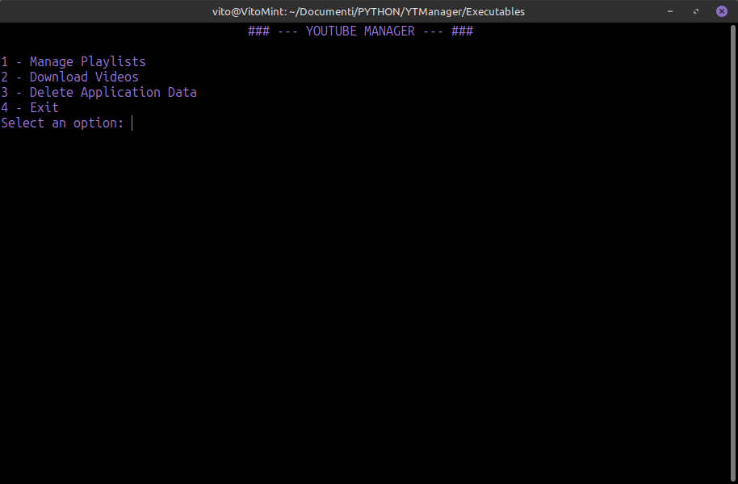
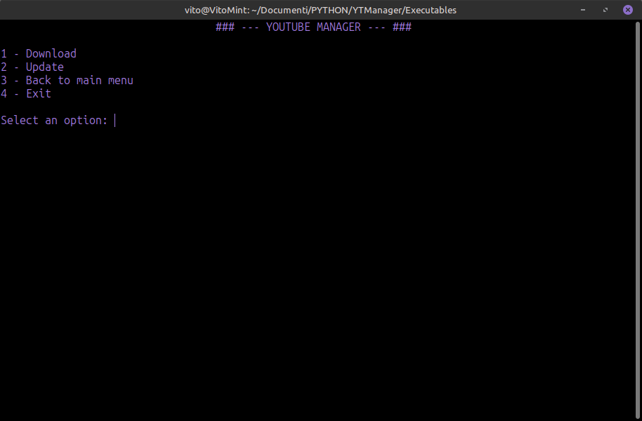
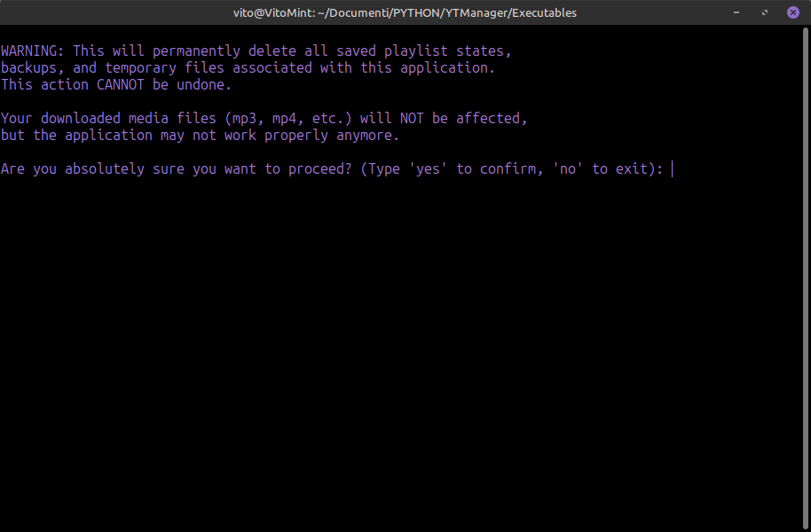

# YTManager


<p align="center">
  
</p>
<p align="center">
   
</p>
<p align="center">
   
</p>
 
---
## YTManager 2.0

### Your Personal YouTube Library, Offline and On Your Terms

YTManager is a simple yet powerful application that lets you download YouTube videos and playlists and save them to your computer. Create your personal music and video library, accessible anywhere, without interruptions.

### Key Features

*   🚀 **Smart Download & Synchronization**
    *   **Download:** Download entire playlists with a single command.
    *   **Update:** Synchronize your local folders with online playlists. YTManager automatically adds new videos, removes unavailable ones, and reorders your files for you.

*   🎬 **Single Videos On the Fly**
    *   Need just one video? Paste the URL and quickly download it in your preferred format.

*   ✨ **Full Control Over Video Quality**
    *   Choose your desired resolution for your videos, from 360p up to 4K. The program will always download the best available quality up to your set limit, optimizing the balance between quality and file size.

*   🎶 **Automatic Metadata & Cover Art**
    *   Every file is enriched with essential metadata: Artist, Album (from the playlist title), Date, and Track Number. For supported formats, the video's cover art is also included, ensuring a neatly organized and easy-to-navigate media library.

*   📂 **Wide Format Support**
    *   Choose the perfect extension for your needs, for both **audio** (`mp3`, `m4a`, `flac`, `opus`, `wav`) and **video** (`mp4`, `mkv`, `webm`).

*   🛡️ **Peace of Mind and Safety**
    *   The most delicate operations, like reordering files, are protected by an **automatic backup system**. In case of issues, your files are safe.

*   🧹 **Clean Data Management**
    *   Want to start fresh? A simple menu option lets you **safely delete all application configuration data**, without ever touching your downloaded media files.

### How to Use

1.  **Download the latest version** from the [**Releases**](https://github.com/VitoCammarata/YTManager/releases) section of this repository.
2.  Place the executable file in the folder where you want your downloads to be saved.
3.  Run the program and follow the simple on-screen instructions.
    *  Open a terminal and run it with `./YTManager`.

### Important Notes

*   **Public Content:** The application works with public or unlisted videos and playlists. Private content is not supported.
*   **Configuration Data:** To keep your download folders 100% clean, YTManager now saves all its working files (playlist states, backups, temp files) in a dedicated system folder (`~/.local/share`). Your downloaded media files are never touched.

### For Developers

If you want to contribute or run the source code:

1.  **Prerequisites:** Make sure you have **Python 3** and **pip** installed.
2.  **Clone the Repository:**
    ```bash
    git clone https://github.com/VitoCammarata/YTManager.git
    cd YTManager
    ```
3.  **Create a Virtual Environment and Install Dependencies:**
    ```bash
    python -m venv venv
    .\venv\Scripts\activate  # On Linux: source venv/bin/activate
    pip install -r requirements.txt
    ```

### Future Roadmap

This project is alive and growing! Future ideas include:
-   A Graphical User Interface (GUI) for an even more intuitive experience.
-   A configuration file to save preferred settings (format, quality, etc.).
-   Android and IOS app.
-   ...and much more!

Have an idea or found a bug? Open an **[Issue](https://github.com/VitoCammarata/YTManager/issues)**! Suggestions are always welcome.
Have an idea or found a bug? Open an **[Issue](https://github.com/VitoCammarata/YTManager/issues)**! Suggestions are always welcome.
